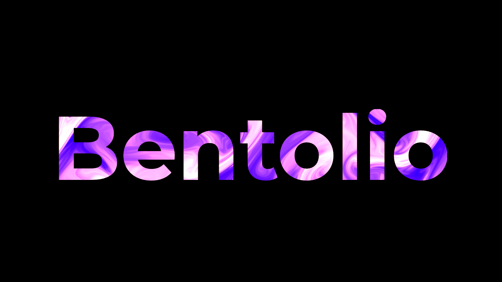

# Bentolio Portfolio Website


A modern, sleek portfolio website featuring smooth scrolling, interactive project showcases, and responsive design.

## Features

- Smooth scroll animations powered by Lenis
- Interactive project showcase with dynamic content switching
- Mobile-responsive navigation
- Modern minimalist design
- Social media integration
- Project gallery with GitHub and live demo links

## Technologies Used

- HTML5
- CSS3
- JavaScript
- Lenis (for smooth scrolling)
- SplitType.js (for text animations)

## Installation

1. Clone the repository
   ```bash
   git clone https://github.com/adityaj08/BentolioV1.git
   ```

2. Navigate to the project directory
   ```bash
   cd BentolioV1
   ```

3. Open `index.html` in your browser or use a local development server

## Usage

The website consists of several sections:
- Navigation bar with mobile responsiveness
- Hero section with introduction
- Projects showcase with interactive gallery
- About section
- Contact information and social links

## Project Structure

bentolio/
├── assets/
│ ├── imgs/
│ └── svg/
├── styles.css
├── app.js
├── preloader.js
└── index.html

## Contributing

1. Fork the project
2. Create your feature branch (`git checkout -b feature/AmazingFeature`)
3. Commit your changes (`git commit -m 'Add some AmazingFeature'`)
4. Push to the branch (`git push origin feature/AmazingFeature`)
5. Open a Pull Request

## License

This project is licensed under the MIT License - see the [LICENSE.md](LICENSE.md) file for details

## Contact
twitter/X - [@aditya_avadhoot](https://twitter.com/aditya_avadhoot)

Project Link : [https://github.com/adityaj08/BentolioV1](https://github.com/adityaj08/BentolioV1)

## Acknowledgments

- [Lenis](https://github.com/studio-freight/lenis) for smooth scrolling
- [SplitType](https://github.com/lukePeavey/SplitType) for text animations
